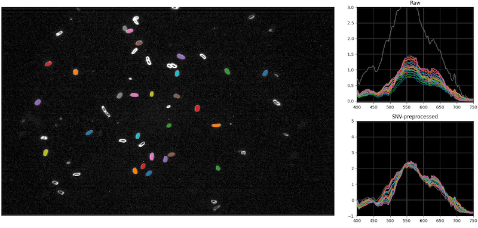
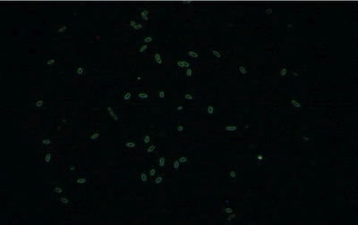
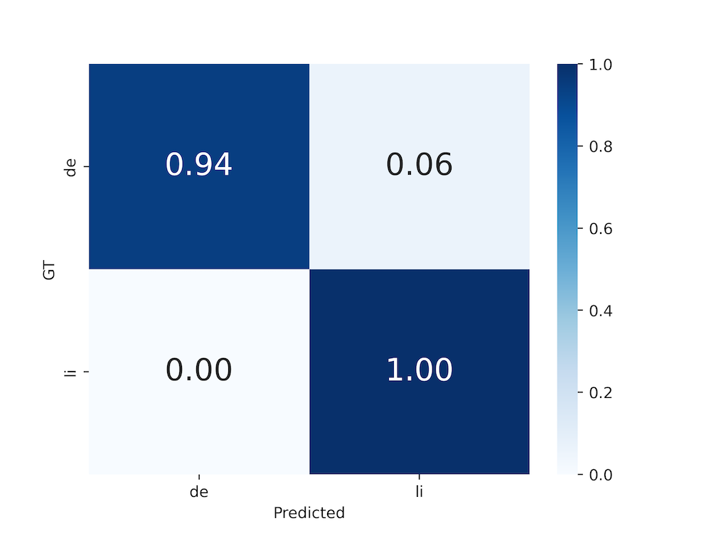

# VBNC-Detection-JFP

This repository provides the code (excluding USDA-ARS proprietary components) and example images for the article **"Detection of Viable but Non-Culturable *E. coli* Induced by Low-Level Antimicrobials Using AI-Enabled Hyperspectral Microscopy"**, published in [Journal of Food Protection](https://doi.org/10.1016/j.jfp.2024.100430).


## Contents

- [Requirements](#requirements)
- [Dataset](#dataset)
- [Data Pre-Processing](#data-pre-processing)
- [Model Training](#model-training)
- [Model Evaluation](#model-evaluation)
- [Example outputs](#example-outputs)
- [Acknowledgments](#acknowledgments)


## Requirements 

1. Create a conda environment using the following command:

    ```
    $ conda create -n vbnc-detection python=3.8
    ```

2. Activate your conda environment named `vbnc-detection`: 

    ```
    $ conda activate vbnc-detection
    ```

3. Run the following command to install required packages:

    ```
    $ pip install -r requirements.txt
    ```


## Dataset

### Classes

In this study, we distinguish between two physiological states of *E. coli* K12 cells:

- **Normal**: *E. coli* cells cultured under optimal growth conditions.
- **VBNC**: VBNCs induced by low-level peracetic acid (PAA).


### Data format

Each raw hyperspectral microscope imaging (HMI) dataset consists of the following files:

- `.dat`: Raw hypercube data file in binary format containing spectral information for each pixel across different wavelengths.
- `.hdr`: Header file with metadata necessary to interpret the `.dat` file.
- `.png`: Pseudo RGB image providing a visual representation of the sample to quickly identify ROI.


## Data Pre-Processing

### Single-cell segmentation (Proprietary USDA-ARS Code)

The `bacterial_hmi` package is a locally developed tool for segmenting single bacterial cells from raw HMI data. This module, created in collaboration with USDA-ARS, is restricted to internal use and is not included in this repository. For methodological details, please refer to [this work](https://doi.org/10.1016/j.compag.2023.107802).

Example visualized output:




### Selecting characteristic spectral wavelengths for Pseudo RGB

A **pseudo RGB** image is created by mapping three selected spectral wavelengths to the red, green, and blue channels, visualizing features from raw HMI data based on the average spectra of single cells.

1. Update the path to your raw input data in `test_our_hmi_data.py`.
    
    ```bash
    # Specify the path to your data directory here
    input_dir = '/path/to/dataset/'
    ```

2. Run the command:
    
    ```
    $ python test_our_hmi_data.py
    ```

3. Three band numbers will be printed as follows:

    ```
    Max of segment 1: [num1], segment 2: [num2], segment 3: [num3]
    passing [num_passing]
    ```

4. Use these band numbers to find the associated wavelengths (e.g., 399.10, 401.00, ... nm) in [Band-to-Wavelength.csv](readme/Band-to-Wavelength.csv) (e.g., Band_1_W_399.10). Then, find the respetive indices (e.g., 17, 18, ...).
    
5. Repeat steps 1–4 for each class (i.e., Normal, VBNC)


### Selecting spectral wavelengths for RGB

**RGB** images can be selected from raw HMI data using their respective wavelengths at approximately 630, 532, and 465 nm. Find the closest wavelengths along with their respective indices, e.g.:

- Red: 630.40 nm (Index 124)
- Green: 533.00 nm (Index 68)
- Blue: 465.00 nm (Index 32)


### Creating (pseudo-)RGB images using band indices

1. Update the path to input (i.e., raw hypercubes) and output (i.e., created 3-channel images) in `test_3_bands.py`. Make sure you have `outputs/Normal` and `outputs/VBNC` in your working directory.

    ```bash
    # Specify the path to your data directory here
    input_dir = '/path/to/dataset'
    output_dir = './outputs/classname'
    output_label = 'classname'
    ```

2. Update the path to your input data (i.e., raw hypercubes) in `test_3_bands.py`. 

3. Run the command:
    ```
    $ python test_3_bands.py
    ```

**NOTE**: This code utilizes the `spectral.io.envi` module from the [Spectral Python (SPy)](https://www.spectralpython.net/) library. You may incorporate the `spectral` library directly into your own scripts and use the indices in the `wavelength` section of any `.hdr` file.


### Data split 

1. From the `outputs/Normal` and `outputs/VBNC` folders manually split the images for model training and evaluation. Split 80% into the `training` folder. Make sure to put the Normal images in the `Normal` folder and VBNC images in the `VBNC` folder.

2. The remaining 20% of your images will go into the `evaluate` folder and should have all of the images together.


## Model Training

```bash
usage: train.py [-h] -r ROOT [-w WORKERS] [-b BATCH] [-g GPUS] [-a ACCUMULATION]

arguments:
  -h, --help            show help message
  -r, --root            Root folder of the dataset (required)
  -w, --workers         Number of dataloader workers per GPU (default: 5)
  -b, --batch           Batch size per GPU (default: 4)
  -g, --gpus            Number of GPUs (default: 1)
  -a, --accumulation    Number of accumulation steps (default: 0)
```

For example: `python train.py -r /path/to/train/dataset/`

The output will inculde several models with different epochs and losses found in lightning logs. Running the above command multiple times will result in different versions. Within lightning logs each version includes checkpoints which you will use to evaluate the models and images.

Example checkpoint: `/path/to/project/lightning_logs/version_X/checkpoints/model-epoch=NN-val_loss=XX.XX.ckpt`


## Model Evaluation

```bash
usage: evaluate.py [-h] -r ROOT -c CKPT [-w WORKERS] [-b BATCH]

arguments:
  -h, --help            show help message
  -r, --root            Root folder of the dataset (required)
  -c, --ckpt            Path to checkpoint file (required)
  -w, --workers         Number of dataloader workers (default: 5)
  -b, --batch           Batch size (default: 1)
```

For example: `python evaluate.py -rt /path/to/train/dataset/ -r /path/to/test/dataset/ -c /path/to/checkpoint/ckpt_weights.ckpt`


## Example Outputs

Example pseudo-RGB image



Example RGB image


Example confusion matrix




## Acknowledgments

- Funding: MSU Startup, MSU Research Foundation's Tetrad Award
- We thank Dr. Bosoon Park (USDA-ARS) for guidance in hyperspectral microscopy data collection and providing modified single-cell segmentation code based on [this work](https://doi.org/10.1016/j.compag.2023.107802).
